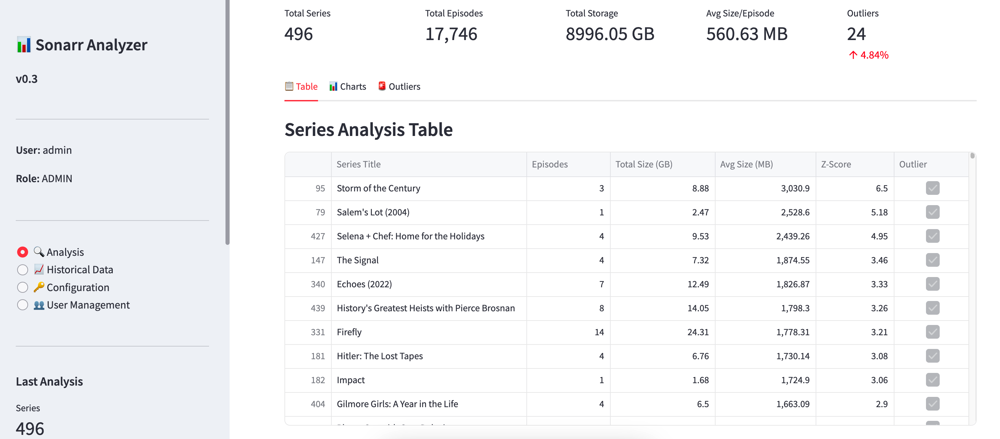
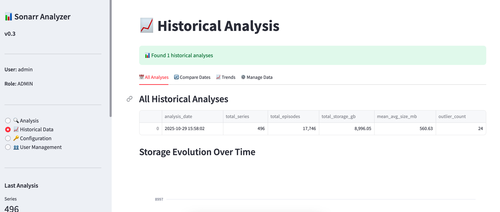

# 📊 Sonarr Analyzer v0.3

[](https://hub.docker.com/r/martitoci/sonarr-analyzer)
[](https://hub.docker.com/r/martitoci/sonarr-analyzer)
[](https://www.python.org/)
[](https://opensource.org/licenses/MIT)

A web application built with Streamlit for analyzing average file size per episode across TV series managed by Sonarr. **Version 0.3 introduces user authentication, role-based access control, and secure per-user encrypted token storage!**

---

## 🚀 Quick Start with Docker

### Pull and Run (Recommended)

```bash
# Pull the latest image
docker pull martitoci/sonarr-analyzer:latest

# Run with persistent data
docker run -d \
  --name sonarr-analyzer \
  -p 8501:8501 \
  -v sonarr-data:/app/data \
  --restart unless-stopped \
  martitoci/sonarr-analyzer:latest
```

**Access the application:** http://localhost:8501

### Using Docker Compose

Create a `docker-compose.yml` file:

```yaml
version: '3.8'

services:
  sonarr-analyzer:
    image: martitoci/sonarr-analyzer:latest
    container_name: sonarr-analyzer
    ports:
      - "8501:8501"
    volumes:
      - sonarr-data:/app/data
    restart: unless-stopped

volumes:
  sonarr-data:
```

Then run:

```bash
docker-compose up -d
```

---

## ✨ What's New in v0.3

### 🔐 User Authentication System
- **Secure login/logout** functionality
- **Bcrypt password hashing** (12 rounds)
- **First-run admin creation** flow
- **Session management** with persistent login

### 👥 Role-Based Access Control
- **Admin Role:**
  - Full access to all features
  - Can create/manage users
  - Can configure Sonarr connections
  - Can run analyses and view history
  
- **Read-Only Role:**
  - Can view analysis results
  - Can view historical data
  - Cannot modify settings
  - Cannot run new analyses

### 🔑 Secure Token Management
- **Per-user encrypted storage** using Fernet (AES-128)
- **Master encryption key** generated on first startup
- **Automatic token decryption** on login
- **Separate configurations** per user

### 📊 Enhanced Visualizations
- **Two decimal place formatting** for all file sizes
- **Improved metric displays** with consistent formatting
- **Better comparison charts** with precise values

### 🧪 Comprehensive Testing
- **60+ unit tests** covering all functionality
- **Integration tests** for complete workflows
- **Role enforcement tests**
- **Security validation tests**

---

## 📸 Screenshots

### Dashboard & Analysis

*Main dashboard showing series analysis with file sizes, outliers, and detailed metrics*

### Historical Data & Trends

*Historical data view with storage evolution, trends over time, and date comparisons*

---

## 📖 Usage Guide

### First Time Setup

1. **Start the container** (see Quick Start above)
2. **Open your browser:** http://localhost:8501
3. **Create Admin Account:**
   - On first launch, you'll see the "Create Admin Account" screen
   - Enter username (min 3 characters)
   - Enter password (min 8 characters)
   - Confirm password
   - Click "Create Admin Account"

4. **Login:**
   - Enter your admin credentials
   - Click "Login"

5. **Configure Sonarr:**
   - Go to "🔑 Configuration" in sidebar
   - Enter Sonarr URL (e.g., `http://192.168.1.10:8989`)
   - Enter API Key (from Sonarr → Settings → General → Security)
   - Choose to save encrypted or use without saving
   - Click "Save Configuration"

---

## 🔐 Authentication Flow

### First Run (No Admin Exists)
```
Start App → Create Admin Screen → Create Admin → Login Screen → Dashboard
```

### Subsequent Runs (Admin Exists)
```
Start App → Login Screen → Enter Credentials → Dashboard
```

### User Roles

| Feature | Admin | Read-Only |
|---------|-------|-----------|
| Login | ✅ | ✅ |
| Configure Sonarr Token | ✅ | ✅ |
| Run Analysis | ✅ | ❌ |
| View Current Results | ✅ | ✅ |
| View Historical Data | ✅ | ✅ |
| Create Users | ✅ | ❌ |
| Manage Users | ✅ | ❌ |
| Delete Analysis Data | ✅ | ❌ |

---

## 👥 User Management (Admin Only)

### Create New Users

1. Login as admin
2. Go to "👥 User Management" in sidebar
3. Enter username, password, and role
4. Click "Create User"

### Manage Existing Users

1. View all users in the management page
2. See user details (created date, last login)
3. Delete users (except yourself and last admin)

---

## 🔑 Token Security

### How It Works

1. **Master Key Generation:**
   - On first startup, a master encryption key is generated
   - Stored in `/app/data/.master.key`
   - Used to encrypt all user tokens

2. **Token Storage:**
   - Each user's Sonarr URL + API key is encrypted
   - Stored in SQLite database (`/app/data/tokens.db`)
   - Encrypted with Fernet (AES-128 in CBC mode)

3. **Token Usage:**
   - On login, user's token is automatically decrypted
   - Used for API calls during session
   - Never stored in plain text

### Security Best Practices

✅ **DO:**
- Use strong passwords (8+ characters, mix of letters/numbers/symbols)
- Keep your data volume backed up
- Use HTTPS if exposing to internet
- Regularly update the Docker image

❌ **DON'T:**
- Share your master encryption key
- Use simple passwords
- Expose port 8501 directly to internet without reverse proxy
- Delete the data volume unless backing up first

---

## 📊 Running Your First Analysis

1. **Login** with your credentials
2. **Configure Sonarr** (if not done already)
3. **Go to "🔍 Analysis"** in sidebar
4. **Configure options** (optional):
   - Request timeout
   - Z-Score threshold
   - Absolute threshold
   - Enable "Save to history"
5. **Click "🚀 Run Analysis"**
6. **Wait for progress** (shows processing status)
7. **Explore results:**
   - **Table:** All series with detailed metrics
   - **Charts:** Visual representations
   - **Outliers:** Series with unusually large files

---

## 📈 Using Historical Data

### View All Analyses

1. Go to "📈 Historical Data" in sidebar
2. Tab: "📅 All Analyses"
3. See:
   - Table of all past analyses
   - Storage evolution chart
   - Average size trends chart

### Compare Two Dates

1. Tab: "🔄 Compare Dates"
2. Select two dates to compare
3. Click "🔄 Compare"
4. Review:
   - Summary metrics (new/removed series, storage change)
   - Detailed comparison table
   - Top changers chart
5. Download comparison CSV

### Track Series Trends

1. Tab: "📈 Trends"
2. Select a series to track
3. Click "📊 Show Trend"
4. View time series charts:
   - Total size evolution
   - Episode count changes
   - Average size per episode

---

## 🧪 Running Tests

The application includes comprehensive tests to ensure reliability and security.

### Using pytest (Recommended)

```bash
# Install test dependencies
pip install -r requirements.txt

# Run all tests
pytest -v

# Run specific test file
pytest tests/test_auth.py -v

# Run with coverage
pytest --cov=. --cov-report=html tests/
```

### Using unittest

```bash
# Run all tests
python -m unittest discover -v

# Run specific test
python -m unittest tests.test_auth.TestUserManager -v
```

### Test Coverage

- ✅ **Authentication:** User creation, login, password hashing
- ✅ **Security:** Token encryption, decryption, key management
- ✅ **Storage:** Database operations, user isolation, comparisons
- ✅ **Integration:** Complete workflows, role enforcement
- ✅ **Validation:** Password complexity, unique constraints

**Total: 60+ tests with comprehensive coverage**

---

## 💾 Data Persistence

### Files Stored in `/app/data`

| File | Purpose | Encrypted |
|------|---------|-----------|
| `users.db` | User accounts and hashed passwords | Passwords hashed |
| `tokens.db` | User Sonarr tokens | ✅ Fully encrypted |
| `.master.key` | Master encryption key | N/A (keep secure!) |
| `sonarr_history.db` | Historical analysis data | No |

### Backup Data Volume

```bash
# Backup
docker run --rm \
  -v sonarr-data:/data \
  -v $(pwd):/backup \
  alpine tar czf /backup/sonarr-data-backup.tar.gz -C /data .

# Restore
docker run --rm \
  -v sonarr-data:/data \
  -v $(pwd):/backup \
  alpine tar xzf /backup/sonarr-data-backup.tar.gz -C /data
```

### Using Local Directory (Bind Mount)

Bind mounts allow you to use a specific directory on your host machine:

```bash
# Create local directory
mkdir -p ./sonarr-data

# Set proper ownership (UID 1000 = appuser in container)
# Linux/macOS:
sudo chown -R 1000:1000 ./sonarr-data

# Windows WSL2:
sudo chown -R 1000:1000 ./sonarr-data

# Run with local mount
docker run -d \
  --name sonarr-analyzer \
  -p 8501:8501 \
  -v $(pwd)/sonarr-data:/app/data \
  martitoci/sonarr-analyzer:latest
```

**Files will be in:** `./sonarr-data/`

**⚠️ Important Notes for Bind Mounts:**
- The container runs as UID 1000 (appuser) for security
- The mounted directory must be writable by UID 1000
- If you see "unable to open database file" errors:
  ```bash
  # Fix permissions on your host:
  sudo chown -R 1000:1000 /path/to/your/data
  ```
- The entrypoint script will attempt to fix permissions automatically
- For maximum compatibility, use named volumes instead of bind mounts

---

## 📊 Understanding the Results

### Metrics Explained

- **Episodes:** Number of downloaded episode files
- **Total Size (GB):** Combined size of all episodes (2 decimal places)
- **Avg Size (MB):** Average file size per episode (2 decimal places)
- **Z-Score:** Statistical deviation from mean (2 decimal places)
- **Outlier:** Yes if Z-Score > threshold (default: 2.0)

### Z-Score Interpretation

The **Z-Score** measures how many standard deviations a value is from the mean:

```
Z-Score = (Value - Mean) / Std Deviation
```

| Z-Score | Meaning | Action |
|---------|---------|--------|
| 0 to 1 | Normal ✅ | No action needed |
| 1 to 2 | Slightly high ⚠️ | Monitor |
| **> 2** | **Outlier 🚨** | **Review and re-encode** |
| > 3 | Extreme 🔥 | **High priority** |

**Example:**
- Mean: 675.50 MB per episode
- Std Dev: 567.25 MB
- Series with 2000.75 MB: Z-Score = 2.34 → **Outlier!**

This series uses ~3x more space than average.

---

## 🔧 Configuration

### Environment Variables

```bash
docker run -d \
  --name sonarr-analyzer \
  -p 8501:8501 \
  -e STREAMLIT_SERVER_PORT=8501 \
  -e STREAMLIT_SERVER_ADDRESS=0.0.0.0 \
  -v sonarr-data:/app/data \
  martitoci/sonarr-analyzer:latest
```

**Available variables:**
- `STREAMLIT_SERVER_PORT` (default: 8501)
- `STREAMLIT_SERVER_ADDRESS` (default: 0.0.0.0)
- `STREAMLIT_SERVER_HEADLESS` (default: true)
- `STREAMLIT_BROWSER_GATHER_USAGE_STATS` (default: false)

### Custom Port

```bash
# Run on port 9000
docker run -d \
  --name sonarr-analyzer \
  -p 9000:8501 \
  -v sonarr-data:/app/data \
  martitoci/sonarr-analyzer:latest
```

Access at: http://localhost:9000

---

## 🐳 Docker Image Details

### Image Information

- **Base Image:** python:3.11-slim
- **Architecture:** linux/amd64, linux/arm64
- **Size:** ~280 MB (includes new dependencies)
- **User:** Non-root (UID 1000)
- **Health Check:** Built-in (Python-based, no curl required)

### Ports

- **8501:** Streamlit web interface

### Volumes

- **/app/data:** Persistent storage for:
  - User database
  - Encrypted tokens
  - Master encryption key
  - Historical analysis data

### Tags

- `latest` - Latest stable release (v0.3)
- `v0.3.0` - Specific version
- `v0.3` - Major version

```bash
# Use specific version
docker pull martitoci/sonarr-analyzer:v0.3.0

# Use latest
docker pull martitoci/sonarr-analyzer:latest
```

---

## 🔍 Troubleshooting

### Cannot Login

**Problem:** "Invalid username or password"

**Solutions:**
1. Verify credentials (case-sensitive)
2. If forgotten, no password recovery yet - need to recreate user database
3. Check logs: `docker logs sonarr-analyzer`

### Database Permission Error with Bind Mounts

**Problem:** "OperationalError: unable to open database file" when using bind mount

**Solutions:**
1. **Fix ownership on host:**
   ```bash
   # Find your bind mount path from docker-compose.yml or docker run command
   sudo chown -R 1000:1000 /path/to/your/data
   
   # Example for ./data:
   sudo chown -R 1000:1000 ./data
   ```

2. **Verify permissions:**
   ```bash
   ls -la /path/to/your/data
   # Should show: drwxr-xr-x ... 1000 1000 ...
   ```

3. **Check container logs:**
   ```bash
   docker logs sonarr-analyzer
   # Look for permission warnings from entrypoint
   ```

4. **Alternative - Use named volume instead:**
   ```bash
   # Named volumes handle permissions automatically
   docker run -d \
     --name sonarr-analyzer \
     -p 8501:8501 \
     -v sonarr-data:/app/data \
     martitoci/sonarr-analyzer:latest
   ```

5. **For NFS/CIFS/Network mounts:**
   - Ensure the network share allows UID 1000 to write
   - Add `uid=1000,gid=1000` to mount options if possible
   - Consider using named volumes with Docker volume drivers

### Cannot Connect to Sonarr

**Problem:** "Connection failed" or timeout

**Solutions:**
1. **Check Sonarr is running**
2. **Verify URL format:**
   - ✅ Good: `http://192.168.1.10:8989`
   - ❌ Bad: `192.168.1.10:8989` (missing http://)
   - ❌ Bad: `localhost:8989` (use host IP from container)
3. **Use host IP or container name** if in same Docker network
4. **Check firewall rules**
5. **Test API key** in Sonarr settings

### Database Errors

**Problem:** "Database is locked" or corruption

**Solutions:**
1. **Restart container:**
   ```bash
   docker restart sonarr-analyzer
   ```
2. **Check permissions:**
   ```bash
   docker exec sonarr-analyzer ls -la /app/data/
   ```
3. **Restore from backup** if corruption persists

### Build Fails in Codespaces/CI

**Problem:** Docker build fails with "package not found" or network errors

**Solutions:**
1. **Ensure internet access:**
   ```bash
   # Test connectivity
   wget -q --spider https://github.com
   echo $?  # Should output 0
   ```

2. **Check Docker daemon:**
   ```bash
   docker version
   docker info
   ```

3. **Clear Docker cache:**
   ```bash
   docker system prune -a
   docker build --no-cache -t sonarr-analyzer .
   ```

4. **If gosu download or verification fails:**
   - The build downloads gosu from GitHub releases and verifies its GPG signature
   - Requires internet access during build (for downloading gosu and fetching GPG keys)
   - If verification fails, check GitHub status: https://www.githubstatus.com/
   - The build installs `gnupg` temporarily for signature verification, then removes it

5. **For corporate proxies:**
   ```bash
   # Set proxy for Docker build
   docker build \
     --build-arg HTTP_PROXY=http://proxy:8080 \
     --build-arg HTTPS_PROXY=http://proxy:8080 \
     -t sonarr-analyzer .
   ```

### High Memory Usage

**Problem:** Container using too much RAM

**Solutions:**
1. **Set memory limits:**
   ```bash
   docker run -d \
     --name sonarr-analyzer \
     -p 8501:8501 \
     -v sonarr-data:/app/data \
     --memory="1g" \
     --memory-swap="1g" \
     martitoci/sonarr-analyzer:latest
   ```

2. **Cleanup old analyses:**
   - Go to 📈 Historical Data → Manage Data (Admin only)
   - Use "Cleanup old data" feature

### Master Key Lost

**Problem:** Master encryption key file deleted/corrupted

**Impact:**
- All encrypted tokens become unrecoverable
- Users must re-enter Sonarr credentials

**Prevention:**
- Always backup `/app/data` volume
- Never delete `.master.key` file

---

## 📈 Use Cases

### Monthly Storage Audit

```
1. Run analysis on 1st of each month
2. Compare with previous month
3. Identify series consuming most storage
4. Decision: Re-encode or delete
```

### Pre/Post Re-encoding Comparison

```
1. Before re-encoding: Run analysis
2. Re-encode series with high Z-scores
3. After re-encoding: Run analysis again
4. Compare dates to see savings (in GB with 2 decimals!)
```

### Library Growth Tracking

```
1. Weekly/monthly analyses
2. Monitor storage evolution chart
3. Plan storage upgrades proactively
4. Track which series are growing fastest
```

### Multi-User Environment

```
1. Admin creates accounts for family members
2. Each user configures their own Sonarr instance
3. Read-only users can view but not modify
4. Separate histories per user
```

---

## 🛠️ Building from Source

If you want to build the image locally:

```bash
# Clone the repository
git clone https://github.com/chmedinap/sonarr-analyzer.git
cd sonarr-analyzer

# Build the image
docker build -t sonarr-analyzer:v0.3 .

# Run your build
docker run -d \
  --name sonarr-analyzer \
  -p 8501:8501 \
  -v sonarr-data:/app/data \
  sonarr-analyzer:v0.3
```

### Building in GitHub Codespaces

The Dockerfile is fully compatible with GitHub Codespaces:

```bash
# In Codespaces terminal
docker build -t sonarr-analyzer:v0.3 .

# Or use docker-compose
docker-compose build
```

**Note:** The build process downloads `gosu` from GitHub releases for privilege management. During build, `gnupg` is temporarily installed to verify the gosu signature, then removed to keep the image slim. This works reliably in Codespaces and all CI/CD environments.

---

## 📝 Version History

### v0.3.0 (Current)
- ➕ Added user authentication with bcrypt
- ➕ Added role-based access control (admin/read-only)
- ➕ Added per-user encrypted token storage (Fernet)
- ➕ Added first-run admin creation flow
- ➕ Added user management (admin only)
- ➕ Added 60+ comprehensive unit tests
- ➕ Added two decimal place formatting for all sizes
- 🔧 Improved security with master key encryption
- 🔧 Improved UI with login/logout functionality
- 🔧 Improved data isolation between users

### v0.2.0
- ➕ Added credential encryption (AES-256)
- ➕ Added SQLite historical database
- ➕ Added date comparison feature
- ➕ Added trend visualizations
- ➕ Added per-series tracking
- ➕ Added configuration page
- ➕ Added historical data page
- 🔧 Improved UI navigation
- 🐳 Enhanced Docker support

### v0.1.0
- Initial release
- Current analysis
- Z-score detection
- Outlier identification
- Interactive visualizations
- CSV export

---

## 🤝 Contributing

Contributions are welcome! Please:
1. Fork the repository
2. Create feature branch
3. Add tests for new features
4. Test thoroughly (run pytest)
5. Submit pull request

---

## 📄 License

MIT License - See LICENSE file for details

---

## 🙏 Acknowledgments

- **Streamlit** - Web framework
- **Plotly** - Interactive charts
- **Cryptography** - Secure encryption (Fernet)
- **Bcrypt** - Password hashing
- **Pandas** - Data analysis
- **Pytest** - Testing framework
- **Sonarr Team** - Amazing media management

---

## 📞 Support

- 🐳 **Docker Hub:** https://hub.docker.com/r/martitoci/sonarr-analyzer
- 📧 **Issues:** GitHub Issues
- 💬 **Discussions:** GitHub Discussions
- 📖 **Documentation:** This README + `/tests/README.md`

---

## ⚡ Quick Commands Reference

```bash
# Pull latest image
docker pull martitoci/sonarr-analyzer:latest

# Run with persistent data
docker run -d --name sonarr-analyzer -p 8501:8501 -v sonarr-data:/app/data martitoci/sonarr-analyzer:latest

# View logs
docker logs -f sonarr-analyzer

# Stop container
docker stop sonarr-analyzer

# Remove container
docker rm sonarr-analyzer

# Backup data
docker run --rm -v sonarr-data:/data -v $(pwd):/backup alpine tar czf /backup/backup.tar.gz -C /data .

# Run tests (if building from source)
pytest -v tests/

# Update to latest
docker pull martitoci/sonarr-analyzer:latest
docker stop sonarr-analyzer
docker rm sonarr-analyzer
docker run -d --name sonarr-analyzer -p 8501:8501 -v sonarr-data:/app/data martitoci/sonarr-analyzer:latest
```

---

**Made with ❤️ for the Sonarr community**

*Secure, analyze, and optimize your Sonarr library with confidence!* 📊✨

**Version 0.3 - Now with Authentication & Role-Based Access!**

**Docker Hub:** https://hub.docker.com/r/martitoci/sonarr-analyzer
